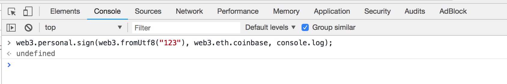
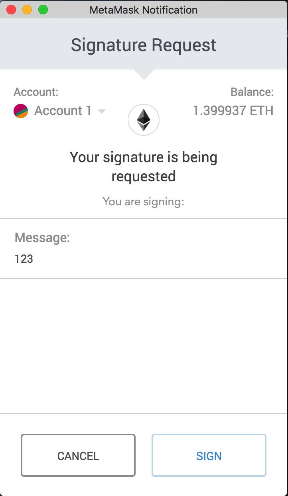
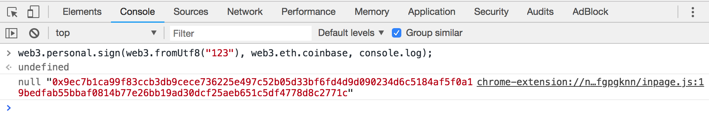
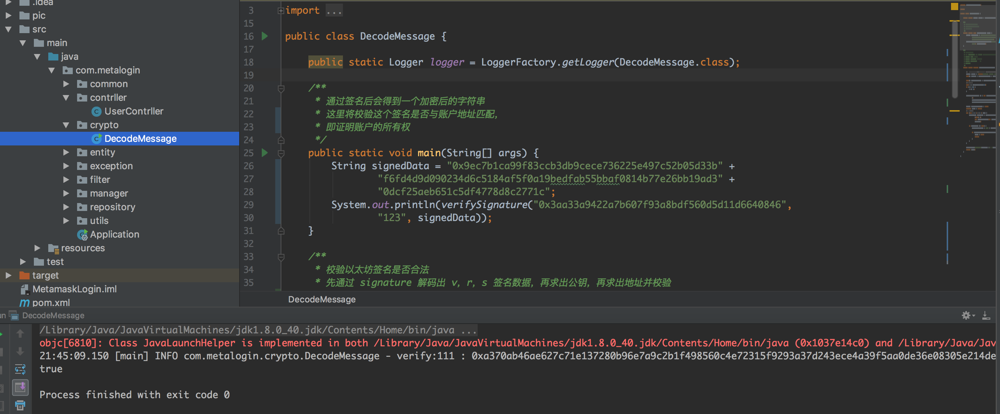
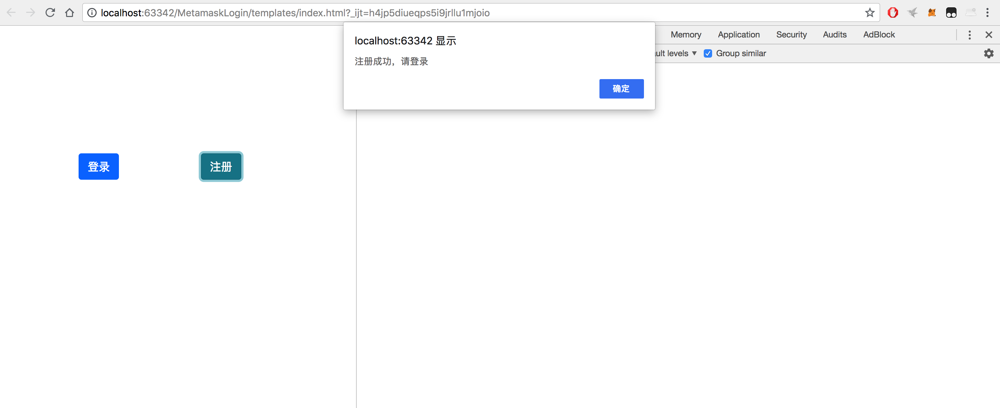
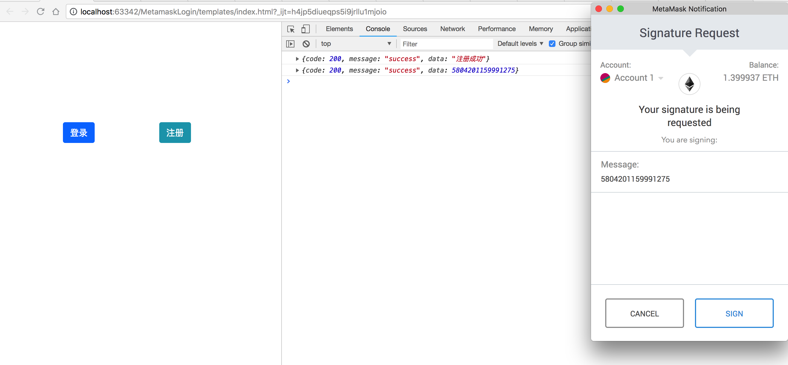
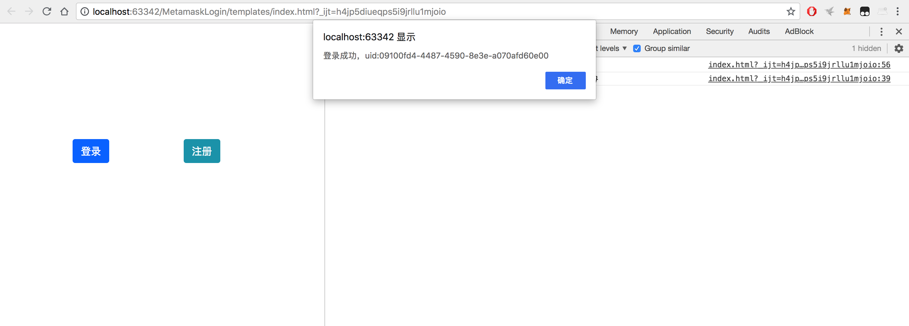

# MetaMask-UserSystem
## 基于以太坊账户的MetaMask无密码用户系统

## 项目思路
首先我们先思考一下login，用户的登录行为就是为了证明账号的所有权，传统服务端对 用户名=>密码 的校验流程在去中心化应用中就显得有些不那么去中心化，那么有没有更适合Dapp的用户系统呢？

coder受结城浩《图解密码技术》和以太坊账户系统的启发，突发奇想，便有了这个Demo，大致特点如下

    简化用户体验(无需密码参与，一键式)
    安全校验(椭圆曲线+单向散列函数)
    隐私(无需邮箱/手机验证)
    针对性(Dapp用户)

首先我们了解一下MetaMask这款浏览器钱包插件

对普通用户来讲，它是一个很好用的以太坊钱包，可以帮我们管理以太坊账户，访问以太坊网络进行转账等等

但是对于开发者来说，它本质上就是一个基于web3的，集成了相关JavaScript库的以太坊节点。而且作为浏览器扩展，它可以很方便的与当前网页进行交互。所以它也集成了大部分以太坊对外提供的操作接口，比如账户管理，签名等...

账户就不用讲了，我们先来看看签名过程

在装有MetaMask的浏览器中登录账户后，Console界面中输入

    //第一个参数为待签名的内容
    //第二个参数为签名者的以太坊账户地址(需要与MetaMask当前登录账户对应)
    //第三个参数为回调函数
    web3.personal.sign(web3.fromUtf8("123"), web3.eth.coinbase, console.log);

敲下回车我们可以看到弹出窗口

MetaMask此时需要钱包持有者来确认这次请求，Message中显示的就是待签内容，我们确认签名后，在console得到签名数据

我们在Java程序(服务端)中校验签名，校验原理为 

sign ==> v,r,s ==> publicKey ==> address 

如果得到的address和签名的账户地址相匹配，证明该数据确实为address所签，这里贴上核心代码

    /**
	 * 校验以太坊签名是否合法
	 * 先通过 signature 解码出 v，r，s 签名数据，再求出公钥，再求出地址并校验
	 * @param from 发送者地址
	 * @param resource 被签名的原数据
	 * @param signature	签名
	 * @return
	 */
	public static boolean verifySignature(String from,String resource,String signature) {

		//  这里一个字符都不能少，eth签名规则必须拼上 "\u0019Ethereum Signed Message:\n"
		String prefix = "\u0019Ethereum Signed Message:\n" + resource.length();
		byte[] msgHash = Hash.sha3((prefix + resource).getBytes());

		byte[] signatureBytes = Numeric.hexStringToByteArray(signature);
		//取出v
		byte v = signatureBytes[64];
		if (v < 27) {
			v += 27;
		}
		//取出r,s,和v一起可以求出公钥
		Sign.SignatureData sd = new Sign.SignatureData(
				v,
				Arrays.copyOfRange(signatureBytes, 0, 32),
				Arrays.copyOfRange(signatureBytes, 32, 64));

		String addressRecovered = null;
		boolean match = false;
		// 遍历recId
		for (int i = 0; i < 4; i++) {
			//计算公钥
			BigInteger publicKey = Sign.recoverFromSignature(
					(byte) i,
					new ECDSASignature(new BigInteger(1, sd.getR()), new BigInteger(1, sd.getS())),
					msgHash);
			if (publicKey != null) {
				//通过公钥计算地址
				addressRecovered = "0x" + Keys.getAddress(publicKey);
				if (addressRecovered.equals(from)) {
					match = true;
					break;
				}
			}
		}

		logger.info("verify:"+resource +" : "+signature +" ==> "+addressRecovered);
		return match;
	}

测试一下，可以看到左下角运行结果打印结果为true

如此一来，我们就完成了 账户持有者的签名(前端) ==> 账户所有权的校验(服务端)。

那么还有一个问题，如果待签数据永远保持不变，用户就可以使用相同的签名再次登录，且一旦签名数据被泄露，攻击者就可以通过用户的address(公开的)和签名数据请求服务端完成验证，很明显这样是不合理的

所以我们可以修改验证流程如下：

1.前端请求服务端生成一个临时大整形随机数nonce，返回前端，并在本地数据库做 用户address ==> 随机数nonce 的映射

2.前端拿到nonce，调用web3.js唤起MetaMask对nonce进行签名，将签名数据和address一起发给服务端做校验

3.服务端拿到address和签名数据，从数据库取出nonce，对3者进行校验(参考代码)，如果签名数据和nonce求出的地址与address相匹配，代表账户所有权验证通过

4.登录成功，服务端返回token，同时立即销毁数据库中 address 对应的 nonce，下次登录便需要重复上述流程，重新请求nonce

如此一来，即便攻击者截获了签名数据，也无法正常登录，因为用户使用的临时nonce在服务端已经被修改，这样就保证了登录过程的安全性

前端页面展示如下(templates/index.html)

首先注册用户，只需将当前以太坊账户address交给服务器做记录

接着点击登录，唤起MetaMask(如果不能自动唤起，尝试手动右上角点进去)，确认签名后，前端回调拿到签名数据发给服务端做校验

校验通过后，登录成功，返回uid/token

详细流程参考代码

这套模型也有很多局限性，最大的考虑就是针对性太强，因为是基于前端插件MetaMask所开发的，所以仅限以太坊系的Dapp，移动端就需要直接使用keystore来进行签名，而秘钥文件的管理也是一个问题

欢迎联系作者：yjhzxhyzq@126.com   vx：yjhzxhyzq